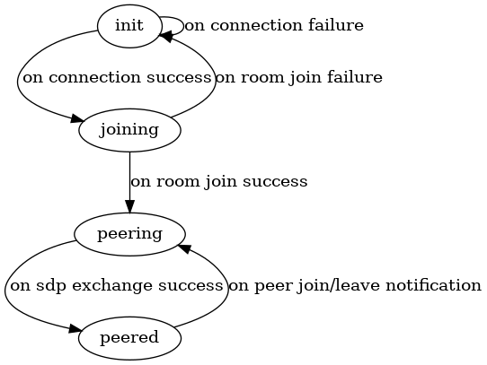

# README

The signaling service establishes a bidirectional communication channel between two clients. It aims to be as simple as possible, delegating most state management to it's clients.

It does:
1. Associate peers by using a rudimentary "room" concept.
1. Use periodic client ping/pong to identify dead clients.
1. Provide clients with a transient session ID specific to the signaling service.

It does not:
1. Do auth of any kind.
1. Support more than two peers in a room.
1. Attempt to prevent "room hijacking" beyond using a short timeout before new clients can replace dead ones.

In the future, it should:
1. Leverage auth provided by a separate mechanism.
1. Delegate room management to a separate service.

## States

These are the states a signaling session moves through.

The conditions required to transition between states are expanded upon below.

* numbered list == all of these things are true
* bulleted list == at least one of these things are true

***CONNECTING***
1. A client has made an HTTP request to our websocket endpoint, and we're trying to upgrade the connection.

***CONNECTED***
1. A client has successfully established a websocket connection.
1. We've supplied the client with a signaling session ID.

***JOINING***
1. The client has sent a "join room" request.
1. We're trying to lock one of the two seats in a room.

***JOINED***
1. We were able to lock one of the seats in a room.
1. We've informed the client which seat they have.
1. We've begun the process of subscribing to the room's pubsub channel.

***SUBSCRIBED***
1. We've subscribed to the room's pubsub channel.
1. We've connected the pubsub to the client's websocket.
1. We've informed the client that they're subscribed.

At this point, the service is just shuttling signaling messages back and forth until something happens that would transition us to a closed state.

***CLOSED_ERR***
* Signaling protocol error: (de)serialization error or bad request.
* Timeout on read from client (either a signaling message or a pong).
* Timeout on write to client.
* Client sends message too large.

These are worth keeping an eye on.

***CLOSED_OK***
* The client has sent a "leave room" message.
* The client has closed the connection or otherwise disappeared.

These are less important to track.

## Signaling Protocol

TODO

